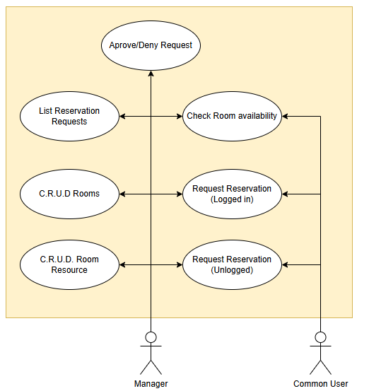
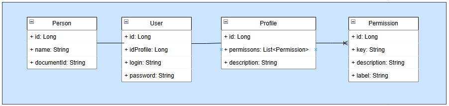
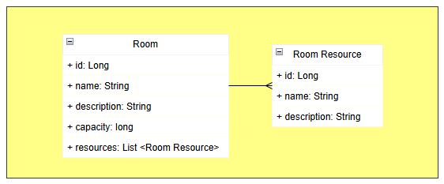
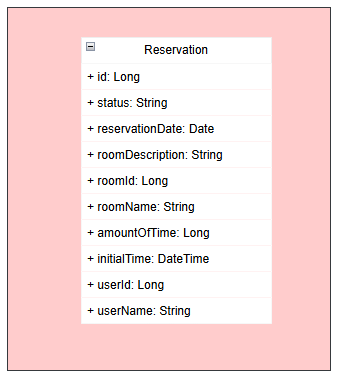

# Room Schedule - Manage rooms booking 	📅🕑
Its is a software to manage my company office rooms bookings. 

### Motivation
There are two main motivation for this project.

> Make it easier to schedule appointments in the company's offices where I work, providing a simple and practical way to check available times and schedule your meetings.

> Use technologies that I study in a practical case and develop familiarity with development patterns

---

## Main Tecnologies and Methods

-  **Spring Boot | JAVA 21**
-  **REST**
-  **DDD**
-  **Modular Monolith pattern**
-  **<a href="https://spring.io/projects/spring-modulith">Spring Modulith</a> to ensure software modularity and DDD**
-  **TDD**
-  **Docker**
-  **And more good development practices ...**

---

## Use Cases and Class Diagram

Below we can see the use cases and relations between classes. There are 3 modules in the system,
_**User**_, _**Room**_ and _**Reservation**_. Each module going to be implemented using _**DDD**_ pattern,
securing that each one can be work independently.

$${\color{red}The \space Diagram \space \space and \space classes \space can \space change \space over \space the \space time!}$$

> - 1 Use Case Diagram 
>
>

> - 2 User Class diagram
>
>

> - 3 Room Class Diagram
>
>

> - 4 Reservation Class Diagram
>
>

